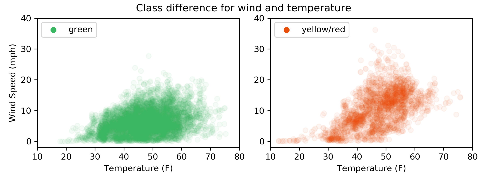
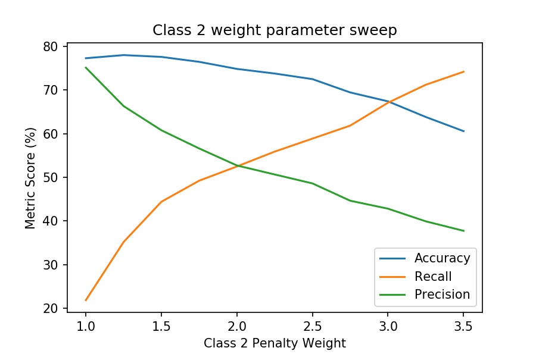
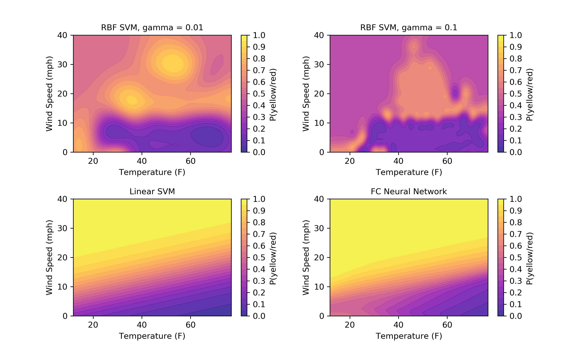

# Cambridge rowing flag predictor
Weather data is from the [DarkSky API](https://darksky.net/dev)

# Using Alexa skill
To enable this skill, search for `Cambridge rowing flag prediction` or find it [here in the Alexa Skills Store](https://www.amazon.co.uk/Tyler-Martin-Cambridge-Rowing-Prediction/dp/B07TQGZLSX/ref=sr_1_1?keywords=cambridge+rowing&qid=1562697643&s=digital-skills&sr=1-1)

Invocation `open flag prediction`

_Response_ `When would you like the prediction for?`

Getting prediction `today at 2 pm`

_Response_ `The weather will be overcast with a 13% chance of a yellow or red flag. Would you like the prediction for another time?`

Exit `quit`

## Problem statement
I wanted to create an algorithm to predict the flag color (https://www.cucbc.org/flag) for rowing conditions in Cambridge, UK based on forecasted weather. Knowing the likely color in advance would help crews cancel or reschedule outings.

In addition, the flag is not always operational, like during university holidays, and it would be useful for rowers still rowing in this time to know about predicted weather conditions to schedule outings.

## Gathering data
Historical flag data (color and time) was collected from two sources

1. [Tweets](https://twitter.com/cucbc) from the last 5 years 

2. Hourly checks of the flag in the past 6 months

With each time, the concurrent weather needed to be found to complete the training set. From a long list of weather details four features were selected: precipitation intensity (0-1), precipitation probablity (0-1), temperature (F), and wind speed (mph). Visibility would also be useful but seems to not have been recorded by DarkSky.

See `data/data_gathering.ipynb` for details of collecting tweets and weather at tweet time and `data/data_generator.py` for details of the hourly checks. The majority of the data is from tweets.

## Making prediction model
The data from two sources was merged into a DataFrame(`data/csvs/merged_df.csv`). Using this, several models and metrics were explored after doing some exploratry data analysis in `data/make_model.ipynb`.

After inspecting the data collected, I decided to make this a binary classifcation problem because the red flag occured very rarely. Therefore the red and yellow instances were combined into a yellow/red class. The wind and temperature for each instance of these two classes was plotted below. Clearly, there is some overlap, likely from the way the flag is set. Many times the flag is set in the morning and is therefore late to changes in the weather.

There are 5834 green flag examples (class 1) compared to 2197 yellow/red flag examples (class 2), meaning a class imblance is present. I ran a parameter sweep using a linear SVM to balance precision and recall. From this, it seems a class 2 weight of 2 and class 1 weight of 1 (constant) is appropriate for this task.

Finally, several models were compared and their decision boundaries (in probability) were plotted. The neural net has two 100 unit fully connected layers with relu activation and a 25% dropout rate followed by a softmax output with 2 units for the two classes. The neural network seems to handle this task well, although the linear SVM provides a decent solution too.
 

Surprisingly, the precipitation features were weakly negatively correlated with the yellow/red flag (an increase in precipiation led to a lower probablity of a yellow/red flag). Although the official guidelines for setting the flag do not mention precipitation, I thought this would be an important feature because it makes conditions seems 
much worse and the flag is set by a subjective human. Perhaps these features could be removed in the future or could be further investigated to see if there is correlation under certain conditions.

The final model (neural net) achieved an accuracy 76.0%, recall of 51.6%, precision of 55.0%. The class weights could be adjusted further but this seems to be a good balance.

## Creating API on AWS Lambda
Next, I wanted to deploy this model to AWS Lambda, which would allow a prediction to be made by accessing a certain URL. I first wrote the model to disk using tensorflow. I followed several blog posts (see resources) about serving tensorflow predictions on Lambda. The process I followed involved launching and EC2 instance and installing libraries on venv to get a `vendored` folder. In addition, `handler.py` takes events and makes predictions using the static model. All of these files and a few more are in `lambda_files/for_serverless/`.

My API endpoint is executable with the following:
`https://mv7r9rtnef.execute-api.us-west-2.amazonaws.com/dev/flag-lambda-dev-predict?x0=${precipIntensity}&x1=${precipProbability}&x2=${temperature}&x3=${windSpeed}`

For example, using `precipIntensity` of 0, `precipProbability` of 0, `temperature` of 67, and `windSpeed` of 0:
`https://mv7r9rtnef.execute-api.us-west-2.amazonaws.com/dev/flag-lambda-dev-predict?x0=0&x1=0&x2=67&x3=0`

Which results in the following prediction
`Prediction 0.07932057`, or 7.9%

## Creating Alexa skill
Finally, I wanted to quickly access these prediction through Alexa, so I created an Alexa skill to do so. The interaction model `alexa_files/interaction.json` was built through the [Alexa Developer Console](https://developer.amazon.com/alexa/console/ask) and defines variables, invocations, etc. Controlling Alexa's response and retreiving the API response happens in `alexa_files/index.js`, which means I had to struggle through a few lines of javascript for the skill to have my desired output. *Cambridge Rowing Flag Prediction* is now live on the [US](https://www.amazon.com/dp/B07V3532C1/ref=sr_1_1?crid=7VUC0IVE5QF2&keywords=cambridge+rowing&qid=1562700595&s=gateway&sprefix=cambridge+row%2Caps%2C211&sr=8-1) and [UK](https://www.amazon.co.uk/Tyler-Martin-Cambridge-Rowing-Prediction/dp/B07TQGZLSX/ref=sr_1_1?keywords=cambridge+rowing&qid=1562697643&s=digital-skills&sr=1-1) Alexa Skills Store.

## Future work
1. The interaction model of the Alexa skill could be better/more advanced
2. An ensenble model might be a better solution as there is a signifant discrepancy betwee Linear SVM and neural net probability prediction 
3. A red flag class could be added with more data

## Resources

[Number Geek Tutorial](https://gist.github.com/muttoni/0b1ee638f6c74a0681f9d694cf11ef63)

[AWS Cloud 9 // Lambda Tutorial](https://medium.com/snapdocs-product-blog/model-services-for-the-cloud-from-the-cloud-or-cloud9-lambda-gateway-data-in-use-d161de65a9cf)

[TF --> Lambda Tutorial](https://medium.com/tooso/serving-tensorflow-predictions-with-python-and-aws-lambda-facb4ab87ddd#.v01eyg8kh)

